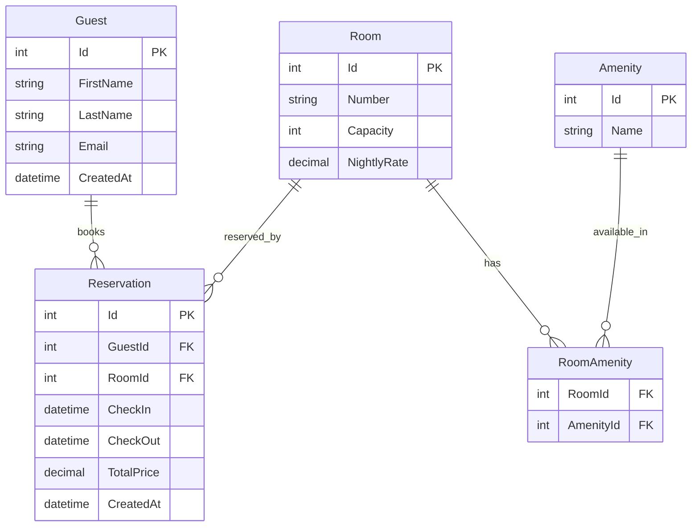

# HotelHub (ASP.NET Core Minimal API)

Hotel-style reservation system with clear separation of concerns:
- **Models**, **Data** (DbContext + Migrations), **Repositories**, **Services**, **Dtos**, **Endpoints (Minimal API)**
- EF Core + SQL Server (Docker), xUnit tests (no endpoint integration tests yet)
- Many-to-many: **Room <-> Amenity** via `RoomAmenity`
- Conflict-free reservations (no overlapping date ranges per room)

## Quick Start

### 1) Start SQL Server in Docker
```bash
docker compose -f docker/docker-compose.sqlserver.yml up -d
```

### 2) Run the API
```bash
cd src/HotelHub.Api
dotnet restore
dotnet build
dotnet ef database update   # optional; Seed also calls Migrate
dotnet run
```
Open Swagger: `http://localhost:5000/swagger` (or port printed in console)

### 3) Sample Flow
1. `POST /guests` `{"firstName":"Ada","lastName":"Lovelace","email":"ada@ex.com"}`
2. `POST /rooms` `{"number":"101","capacity":2,"nightlyRate":129.99}`
3. `GET /reservations/availability?roomId=1&checkIn=2025-10-01&checkOut=2025-10-04`
4. `POST /reservations` with same dates
5. Try overlapping `POST /reservations` → expect **409 Conflict**

### 4) Tests
```bash
dotnet test --collect:"XPlat Code Coverage"
```

## Endpoints

- **Guests:** `GET /guests`, `GET /guests/{id}`, `POST /guests`, `DELETE /guests/{id}`
- **Rooms:** `GET /rooms`, `GET /rooms/{id}`, `POST /rooms`, `DELETE /rooms/{id}`
- **Amenities:** `GET /amenities`, `POST /amenities`, `POST /amenities/rooms/{roomId}/{amenityId}`
- **Reservations:** `GET /reservations`, `GET /reservations/{id}`, `GET /reservations/availability`, `POST /reservations`, `DELETE /reservations/{id}`

## ERD (Mermaid)


## Tech
- .NET 8, EF Core, SQL Server (Docker), Swagger, xUnit
